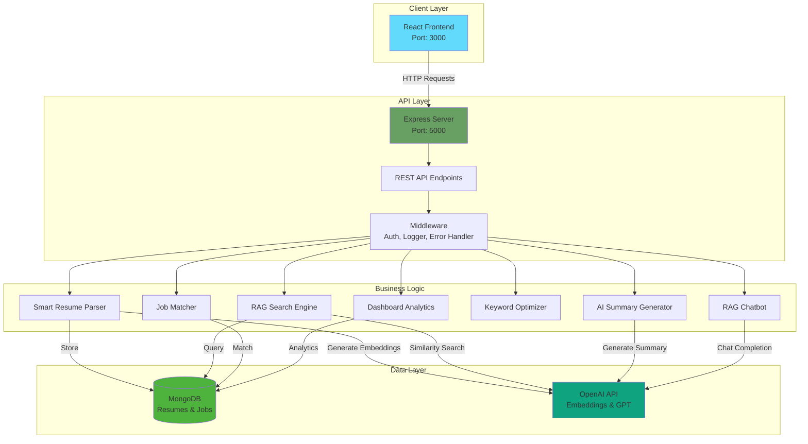

# ResumeRAG - AI Resume Management System

**A full-stack web application for intelligent resume management with AI-powered matching and analysis.**

Built with React, Node.js, MongoDB, and OpenAI API.

---

## 🚀 Quick Start

```bash
# 1. Clone/navigate to the project
cd "RAG Resume"

# 2. Setup backend
cd backend
npm install
cp .env.example .env
# Edit .env with your MongoDB URI and OpenAI API key
npm run dev

# 3. Setup frontend (in new terminal)
cd frontend
npm install
npm start

# 4. Open browser
http://localhost:3000
```

## 📋 Table of Contents

- [Features](#-features)
- [Architecture](#-architecture)
- [Tech Stack](#-tech-stack)
- [Project Structure](#-project-structure)
- [Setup Guide](#️-setup-guide)
- [API Documentation](#-api-documentation)
- [Component Overview](#-component-overview)
- [Integration](#-integration)
- [Testing](#-testing)
- [Deployment](#-deployment)
- [Contributing](#-contributing)

## ✨ Features

- **Smart Resume Upload** - Upload and parse PDF/DOCX resumes
- **AI-Powered Search** - Find matching candidates using job descriptions
- **Role-Based Access** - Separate dashboards for Recruiters and Job Seekers
- **Keyword Optimization** - ATS score calculator
- **AI Summary Generator** - Generate professional summaries
- **Chatbot Assistant** - Get career advice and tips

## 🏗️ System Architecture



## 🛠️ Tech Stack

**Frontend:**
- React 18
- React Router
- Axios

**Backend:**
- Node.js + Express
- MongoDB (Mongoose)
- OpenAI API
- Multer (file uploads)


## 📁 Project Structure

```
RAG Resume/
├── frontend/                          # React application
│   ├── public/
│   │   └── index.html
│   ├── src/
│   │   ├── api/
│   │   │   └── api.js                # API integration layer
│   │   ├── components/
│   │   │   ├── SmartResumeParsing.jsx
│   │   │   ├── RAGSearch.jsx
│   │   │   ├── JobMatchRecommendation.jsx
│   │   │   ├── AISummaryGeneration.jsx
│   │   │   ├── KeywordOptimization.jsx
│   │   │   ├── InteractiveDashboard.jsx
│   │   │   └── RAGChatbot.jsx
│   │   ├── styles/
│   │   │   ├── variables.css        # Design tokens
│   │   │   ├── main.css             # Global styles
│   │   │   └── components.css       # Component styles
│   │   ├── App.js                   # Main app component
│   │   └── index.js                 # Entry point
│   ├── .env                          # Frontend environment
│   └── package.json
│
├── backend/                           # Node.js + Express API
│   ├── config/
│   │   ├── db.js                    # MongoDB connection
│   │   └── openai.js                # OpenAI setup
│   ├── middleware/
│   │   ├── auth.js                  # JWT authentication
│   │   ├── errorHandler.js          # Error handling
│   │   └── logger.js                # Request logging
│   ├── models/
│   │   ├── Resume.js                # Resume schema
│   │   └── Job.js                   # Job schema
│   ├── modules/
│   │   ├── SmartResumeParsing.js
│   │   ├── RAGSearch.js
│   │   ├── JobMatchRecommendation.js
│   │   ├── AISummaryGeneration.js
│   │   ├── KeywordOptimization.js
│   │   ├── InteractiveDashboard.js
│   │   └── RAGChatbot.js
│   ├── routes/
│   │   ├── resumeRoutes.js
│   │   ├── jobRoutes.js
│   │   ├── chatbotRoutes.js
│   │   └── dashboardRoutes.js
│   ├── utils/
│   │   ├── embeddingHelper.js       # Embeddings & similarity
│   │   ├── parseUtils.js            # File parsing
│   │   └── responseHelper.js        # Response formatting
│   ├── index.js                     # Server entry point
│   ├── .env.example                 # Environment template
│   └── package.json
│
├── SETUP_GUIDE.md                    # Complete setup instructions
├── INTEGRATION_GUIDE.md              # Integration testing guide
└── README.md                         # This file
```

## ⚙️ Setup Guide

### Prerequisites

- Node.js 16+ ([Download](https://nodejs.org/))
- MongoDB ([Download](https://www.mongodb.com/try/download/community) or use [Atlas](https://www.mongodb.com/cloud/atlas))
- OpenAI API Key ([Get Key](https://platform.openai.com/api-keys)) - Optional

### Installation

#### 1. Backend Setup

```bash
cd backend
npm install
```

Create `.env` file:
```bash
cp .env.example .env
```

Edit `backend/.env`:
```env
PORT=5000
NODE_ENV=development
MONGODB_URI=mongodb://localhost:27017/resumerag
OPENAI_API_KEY=sk-your-key-here
JWT_SECRET=your-secret-here
CORS_ORIGINS=http://localhost:3000
```

Start backend:
```bash
npm run dev
```

#### 2. Frontend Setup

```bash
cd frontend
npm install
npm start
```

Frontend will open at `http://localhost:3000`

### Verification

Backend health check:
```bash
curl http://localhost:5000/health
```

Expected response:
```json
{
  "status": "OK",
  "message": "ResumeRAG API is running"
}
```

## 📡 API Endpoints

### Base URL
```
http://localhost:5000/api
```

### 📄 Resume APIs

#### 1. Upload Resume
```http
POST /api/resume/upload
Content-Type: multipart/form-data

Body: 
- resume: File (PDF/DOCX)
- userId: String (optional)
- uploaderName: String (optional)
- uploaderEmail: String (optional)

Response:
{
  "success": true,
  "data": {
    "_id": "resume_id",
    "filename": "john_doe.pdf",
    "name": "John Doe",
    "email": "john@email.com",
    "phone": "+1-234-567-8900",
    "skills": ["JavaScript", "React", "Node.js"],
    "education": ["B.S. Computer Science"],
    "embedding": [0.123, ...],
    "uploadedAt": "2024-01-01T00:00:00.000Z"
  }
}
```

#### 2. Get All Resumes
```http
GET /api/resume?userId=user123

Response:
{
  "success": true,
  "data": {
    "resumes": [...],
    "total": 10
  }
}
```

#### 3. Get Resume by ID
```http
GET /api/resume/:id

Response:
{
  "success": true,
  "data": {
    "_id": "resume_id",
    "filename": "resume.pdf",
    "name": "John Doe",
    ...
  }
}
```

#### 4. RAG Search Resumes
```http
POST /api/resume/search
Content-Type: application/json

Body:
{
  "jobDescription": "Looking for React developer with 3 years experience",
  "limit": 10
}

Response:
{
  "success": true,
  "data": [
    {
      "id": "resume_id",
      "name": "John Doe",
      "email": "john@email.com",
      "matchScore": 85,
      "skills": ["React", "JavaScript"],
      ...
    }
  ]
}
```

#### 5. Generate AI Summary
```http
POST /api/resume/:id/generate-summary
Content-Type: application/json

Body:
{
  "jobDescription": "Senior React Developer role" (optional)
}

Response:
{
  "success": true,
  "data": {
    "summary": "Experienced software engineer with 5+ years...",
    "resumeId": "resume_id"
  }
}
```

#### 6. Keyword Optimization
```http
POST /api/resume/:id/optimize-keywords
Content-Type: application/json

Body:
{
  "jobDescription": "React developer with TypeScript experience..."
}

Response:
{
  "success": true,
  "data": {
    "atsScore": 75,
    "matchedKeywords": ["React", "JavaScript"],
    "missingKeywords": ["TypeScript", "Redux"],
    "suggestions": ["Add TypeScript to skills section"]
  }
}
```

#### 7. Delete Resume
```http
DELETE /api/resume/:id

Response:
{
  "success": true,
  "message": "Resume deleted successfully"
}
```

---

### 💼 Job APIs

#### 1. Create Job
```http
POST /api/jobs
Content-Type: application/json

Body:
{
  "title": "Senior React Developer",
  "company": "Tech Corp",
  "description": "We are looking for...",
  "requiredSkills": ["React", "TypeScript"],
  "location": "Remote",
  "salary": "$120k-$150k"
}

Response:
{
  "success": true,
  "data": {
    "_id": "job_id",
    "title": "Senior React Developer",
    "embedding": [...],
    ...
  }
}
```

#### 2. Get All Jobs
```http
GET /api/jobs

Response:
{
  "success": true,
  "data": {
    "jobs": [...],
    "total": 25
  }
}
```

#### 3. Find Matching Candidates
```http
POST /api/jobs/:id/find-candidates
Content-Type: application/json

Body:
{
  "limit": 10
}

Response:
{
  "success": true,
  "data": [
    {
      "resumeId": "resume_id",
      "name": "John Doe",
      "matchScore": 92,
      "matchedSkills": ["React", "TypeScript"],
      "missingSkills": []
    }
  ]
}
```

#### 4. Get Job Recommendations
```http
POST /api/jobs/recommend
Content-Type: application/json

Body:
{
  "resumeId": "resume_id",
  "limit": 5
}

Response:
{
  "success": true,
  "data": [
    {
      "jobId": "job_id",
      "title": "React Developer",
      "company": "Tech Corp",
      "matchPercentage": 88,
      "matchedSkills": ["React", "Node.js"]
    }
  ]
}
```

---

### 💬 Chatbot APIs

#### 1. Send Message
```http
POST /api/chatbot/message
Content-Type: application/json

Body:
{
  "message": "How do I improve my resume?",
  "context": "resume_context" (optional)
}

Response:
{
  "success": true,
  "data": {
    "reply": "Here are some tips to improve your resume...",
    "timestamp": "2024-01-01T00:00:00.000Z"
  }
}
```

#### 2. Natural Language Search
```http
POST /api/chatbot/search
Content-Type: application/json

Body:
{
  "query": "Find React developers with 5 years experience"
}

Response:
{
  "success": true,
  "data": {
    "results": [...],
    "count": 5
  }
}
```

#### 3. Get Greeting
```http
GET /api/chatbot/greeting

Response:
{
  "success": true,
  "data": {
    "message": "Hello! I'm your AI career assistant. How can I help you today?"
  }
}
```

---

### 📊 Dashboard APIs

#### 1. Get Statistics
```http
GET /api/dashboard/stats

Response:
{
  "success": true,
  "data": {
    "totalResumes": 248,
    "activeJobs": 56,
    "matchesFound": 892,
    "successRate": "94%"
  }
}
```

#### 2. Get Top Skills
```http
GET /api/dashboard/top-skills?limit=10

Response:
{
  "success": true,
  "data": {
    "topSkills": [
      { "skill": "JavaScript", "count": 150 },
      { "skill": "React", "count": 120 },
      { "skill": "Python", "count": 95 }
    ]
  }
}
```

#### 3. Get Analytics
```http
GET /api/dashboard/analytics

Response:
{
  "success": true,
  "data": {
    "resumesByMonth": [...],
    "topSkills": [...],
    "educationDistribution": [...],
    "matchStatistics": {...}
  }
}
```

---

### 🔒 Health Check

```http
GET /health

Response:
{
  "status": "OK",
  "message": "ResumeRAG API is running",
  "timestamp": "2024-01-01T00:00:00.000Z"
}
```

## 🎨 Component Overview

### 1. SmartResumeParsing
- File upload with drag-and-drop support
- PDF/DOCX parsing
- Real-time text preview
- Structured data extraction

### 2. RAGSearch
- Natural language job description input
- Semantic search with embeddings
- Result cards with match scores
- Skills highlighting

### 3. JobMatchRecommendation
- Resume selection dropdown
- Top job recommendations
- Match percentage visualization
- Skill overlap analysis

### 4. AISummaryGeneration
- Resume selection
- AI-powered summary generation
- Copy to clipboard
- Edit capabilities

### 5. KeywordOptimization
- Job description vs resume analysis
- ATS score calculation
- Matched/missing keywords
- Optimization suggestions

### 6. InteractiveDashboard
- Statistics cards
- Top skills visualization
- Trend charts (placeholder)
- Real-time data

### 7. RAGChatbot
- Conversational interface
- Context-aware responses
- Natural language understanding
- Career advice

## 🔗 Integration

### Frontend → Backend Flow

```javascript
// Frontend component
import { uploadResume } from '../api/api';

const handleUpload = async (file) => {
  const response = await uploadResume(file);
  // Handle response
};

// API layer (src/api/api.js)
export const uploadResume = async (file) => {
  const formData = new FormData();
  formData.append('resume', file);
  const response = await api.post('/api/resume/upload', formData);
  return response.data;
};

// Backend route
router.post('/upload', upload.single('resume'), async (req, res) => {
  const parsedData = await parseResume(req.file.buffer, ...);
  // Return response
});
```

### Environment Variables

**Frontend (.env):**
```env
REACT_APP_API_URL=http://localhost:5000
```

**Backend (.env):**
```env
PORT=5000
MONGODB_URI=mongodb://localhost:27017/resumerag
OPENAI_API_KEY=sk-...
JWT_SECRET=...
CORS_ORIGINS=http://localhost:3000
```

## 🧪 Testing

### Manual Testing

1. **Upload Resume:**
   - Navigate to Smart Resume Parsing
   - Upload a PDF/DOCX file
   - Verify parsed data appears

2. **Search Resumes:**
   - Enter job description in RAG Search
   - Verify results with match scores

3. **Get Recommendations:**
   - Select a resume in Job Match
   - Verify job recommendations appear

See `INTEGRATION_GUIDE.md` for complete testing instructions.

### API Testing

```bash
# Health check
curl http://localhost:5000/health

# Upload resume
curl -X POST http://localhost:5000/api/resume/upload \
  -F "resume=@resume.pdf"

# Search resumes
curl -X POST http://localhost:5000/api/resume/search \
  -H "Content-Type: application/json" \
  -d '{"jobDescription": "React developer", "limit": 10}'
```

## 🚀 Deployment

### Backend Deployment

**Recommended Platforms:**
- Heroku
- Railway
- Render
- AWS EC2

**Build Command:**
```bash
npm install
```

**Start Command:**
```bash
npm start
```

**Environment Variables:** Set all variables from `.env.example`

### Frontend Deployment

**Recommended Platforms:**
- Vercel
- Netlify
- AWS S3 + CloudFront

**Build Command:**
```bash
npm run build
```

**Environment Variables:**
```env
REACT_APP_API_URL=https://your-backend-url.com
```

## 🎯 Features in Detail

### RAG Implementation

The application uses Retrieval-Augmented Generation (RAG) for intelligent resume matching:

1. **Embedding Generation:** Resumes and job descriptions are converted to vector embeddings using OpenAI's text-embedding-ada-002 model

2. **Similarity Search:** Cosine similarity is calculated between job description embeddings and resume embeddings

3. **Ranking:** Results are ranked by similarity score and presented with match percentages

4. **Context Enhancement:** Chat responses use retrieved resume context for accurate answers

### OpenAI Integration

- **Embeddings:** `text-embedding-ada-002` (1536 dimensions)
- **Chat:** `gpt-3.5-turbo` for summaries and chatbot
- **Fallback:** System works without OpenAI key (demo mode)

### Database Schema

**Resume:**
```javascript
{
  filename: String,
  name: String,
  email: String,
  skills: [String],
  education: [String],
  rawText: String,
  embedding: [Number], // 1536-dimensional vector
  uploadedAt: Date
}
```

**Job:**
```javascript
{
  title: String,
  company: String,
  description: String,
  requiredSkills: [String],
  embedding: [Number],
  status: String, // 'active', 'closed', 'draft'
  postedAt: Date
}
```

## 🤝 Contributing

Contributions are welcome! Please follow these steps:

1. Fork the repository
2. Create a feature branch (`git checkout -b feature/AmazingFeature`)
3. Commit your changes (`git commit -m 'Add some AmazingFeature'`)
4. Push to the branch (`git push origin feature/AmazingFeature`)
5. Open a Pull Request

## 📝 License

This project is licensed under the ISC License.

## 🙏 Acknowledgments

- OpenAI for embeddings and chat APIs
- MongoDB for database
- React community for excellent documentation
- Express.js for robust backend framework

## 📞 Support

For issues or questions:
- Check `SETUP_GUIDE.md` for setup help
- Check `INTEGRATION_GUIDE.md` for testing help
- Review backend and frontend README files
- Open an issue on GitHub

---

<div align="center">

**Built with ❤️ using React, Node.js, MongoDB, and OpenAI**

</div>
